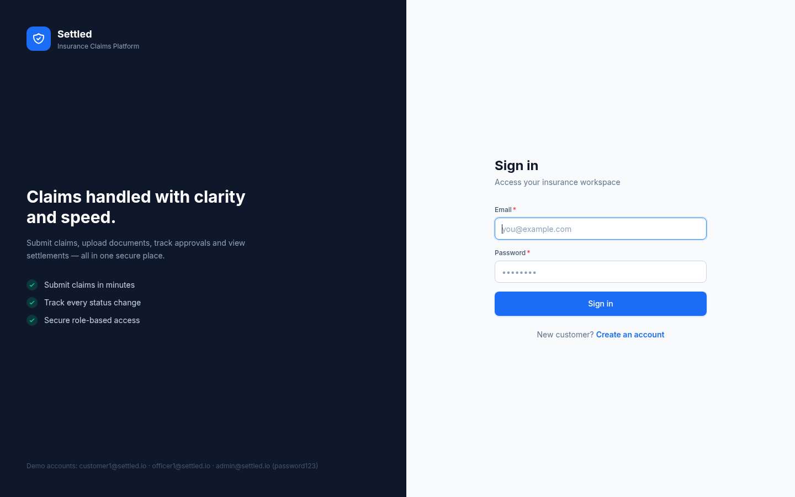
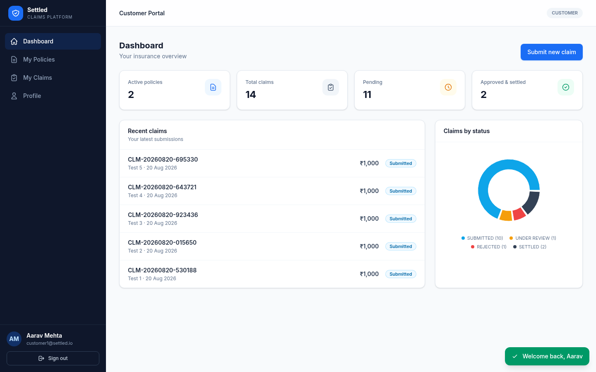
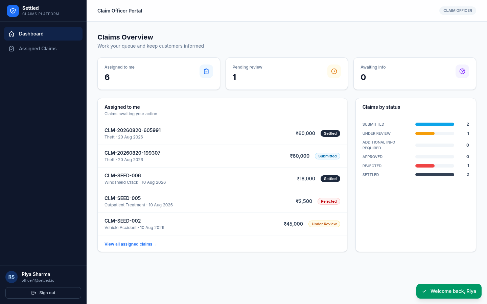
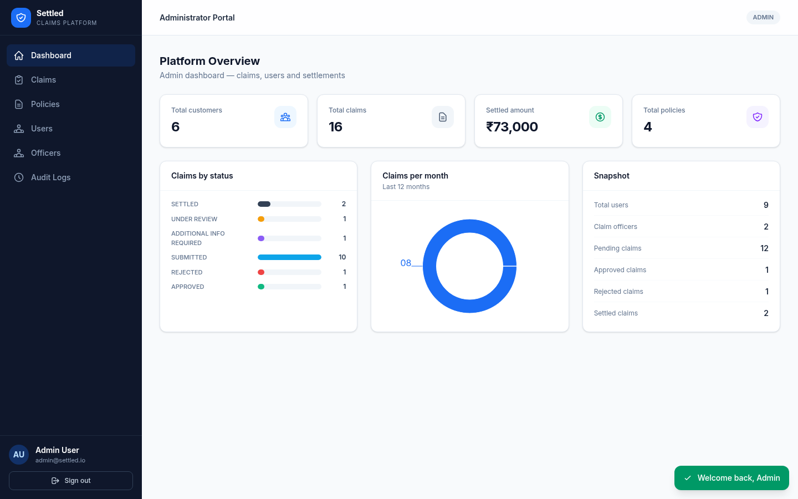

# Settled — Insurance Claims Management Platform

A full-stack insurance claim management platform. Customers submit claims against their policies,
claim officers review, approve and settle them, and admins manage users, officers, policies and
audit everything.

Built with **Spring Boot 3.5** (Java 21), **PostgreSQL 16**, **Redis 7**, **React 19** (Vite + TypeScript + Tailwind CSS v4).

---

## Features

- **Role-based access**: Customers, Claim Officers and Admins — each with its own dashboard and permissions
- **Full claim lifecycle**: `SUBMITTED → UNDER_REVIEW → ADDITIONAL_INFO_REQUIRED → UNDER_REVIEW → APPROVED → SETTLED`, plus `REJECTED`, enforced by a state machine with validation
- **Document uploads**: PDFs and images stored on the filesystem (Docker volume), downloadable by claim stakeholders
- **Claim notes**: public notes (visible to the customer) and internal notes (staff only)
- **Settlements**: one settlement per approved claim, with settled amount ≤ approved amount
- **Audit trail**: every important action is recorded — who, what, when, and from which IP
- **Redis caching**: customer / officer / admin dashboards and policy types cached with TTLs
- **Rate limiting** (Redis-backed):
  - Login: 5 attempts / minute / IP → HTTP 429
  - Claim submission: 10 claims / hour / user → HTTP 429
- **JWT auth**: HS256 tokens with role claims; passwords bcrypt-hashed
- **Seed data**: demo users, policy types, policies, claims and settlements auto-seeded on first boot

## Demo accounts

All passwords are `password123`:

| Role | Email | Capabilities |
|---|---|---|
| Admin | `admin@settled.io` | Platform dashboard, user management, all claims/policies, audit logs, analytics |
| Claim Officer | `officer1@settled.io`, `officer2@settled.io` | Assigned claims: request info, approve, reject, settle, internal notes |
| Customer | `customer1@settled.io`, `customer2@settled.io`, `customer3@settled.io` | Policies, submit claims, upload documents, respond to info requests, track status |

## Architecture

```
┌──────────────┐   ┌──────────────┐   ┌──────────────┐
│  frontend     │   │  backend      │   │  postgres:16  │
│  nginx:3001   │──▶│  spring:8081  │──▶│  :5433        │
│  React SPA    │   │  /api/*       │   └──────────────┘
└──────────────┘   │               │   ┌──────────────┐
                   │               │──▶│  redis:7      │
                   │               │   │  :6380        │
                   └──────────────┘   └──────────────┘
```

- `nginx` serves the built SPA and proxies `/api/` to the backend, so the browser never talks to the backend directly
- Backend container runs the packaged jar; documents are stored on the `uploads-data` volume
- Redis is used for caching (dashboards, policy types) and rate limiting (login, claims)

## Quick start

Requires Docker with the Compose plugin.

```bash
cp .env.example .env    # ports: backend 8081, frontend 3001 (adjust if taken)
docker compose up -d --build
```

Then open **http://localhost:3001** and sign in with any demo account.

- Backend health: http://localhost:8081/actuator/health
- Swagger UI: http://localhost:8081/swagger-ui.html (37 API endpoints)

To stop: `docker compose down` (add `-v` to wipe the database and uploaded files).

## Running in development

### Backend

```bash
cd backend
./mvnw spring-boot:run
```

Defaults to `jdbc:postgresql://localhost:5433/settled` and Redis on port 6380 — the containers
`settled-postgres` and `settled-redis` from `docker compose up -d postgres redis` provide both.

### Frontend

```bash
cd frontend
npm install
npm run dev          # http://localhost:5173, proxies /api to localhost:8080
```

## Tests

```bash
cd backend
./mvnw test          # 22 tests — integration (Testcontainers) + unit
```

- `ClaimLifecycleIntegrationTest` — full lifecycle against real Postgres + Redis (Testcontainers)
- `AuthServiceTest` — registration, duplicate email, bad credentials
- `ClaimServiceTest` — submission, ownership checks, assignment, approval rules
- `ClaimStateMachineTest` — legal and illegal transitions

## Claim lifecycle

```
                    ┌──────────────┐
                    ▼              │
SUBMITTED ──▶ UNDER_REVIEW ──▶ ADDITIONAL_INFO_REQUIRED
   │              │  │                      │
   │              │  └──── (customer responds) ──┘
   │              ▼
   │           APPROVED ──▶ SETTLED
   │              │
   └─── (admin assigns to officer on submit) ──┘
                 REJECTED
```

- Officers can only act on claims **assigned to them** (admins are exempt)
- Assignment auto-transitions `SUBMITTED → UNDER_REVIEW`
- An approved claim can be settled once, for an amount ≤ the approved amount

## Security

- JWT (HS256, configurable expiry) in the `Authorization: Bearer` header
- Login rate limit filter runs before authentication (429 after 5 failed logins/min/IP)
- Claim submission capped at 10/hour/user
- Role checks at the method level (`@PreAuthorize`) and URL matchers; ownership checks inside services
- Passwords bcrypt-hashed; uploaded file types/sizes validated

## Project layout

```
backend/
  src/main/java/com/settled/
    config/       # Security, Redis, CORS, seed data, JWT filter, rate-limit filter
    controller/   # REST controllers (auth, claims, policies, admin, dashboards)
    service/      # Business logic, claim state machine, audit, analytics, file storage
    repository/   # Spring Data JPA
    domain/       # Entities + enums
    dto/          # Request/response records
    common/       # ApiResponse/PageResponse envelope, current-user resolution
  src/test/       # Unit + Testcontainers integration tests
frontend/
  src/pages/      # customer/ officer/ admin/ auth/
  src/components/ # layout, UI kit (Button, Card, Modal, Toast…), charts, timeline
  src/lib/        # axios client, formatters
  nginx.conf      # SPA fallback + /api proxy
docs/screenshots/ # captured UI screenshots
```

## Screenshots

| | |
|---|---|
|  |  |
|  |  |